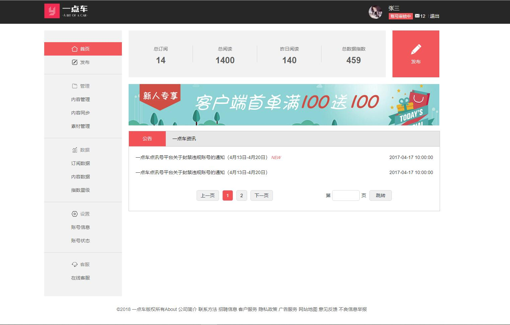
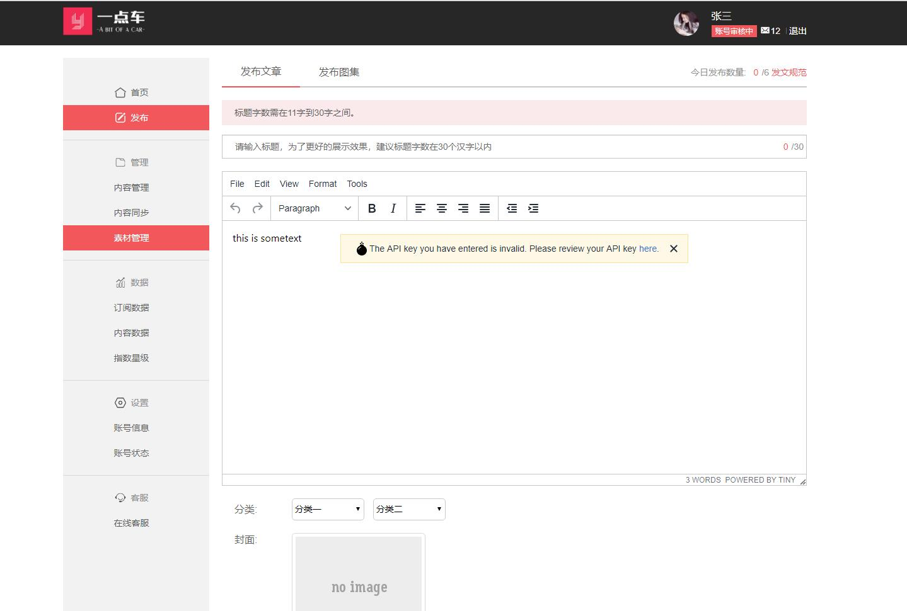
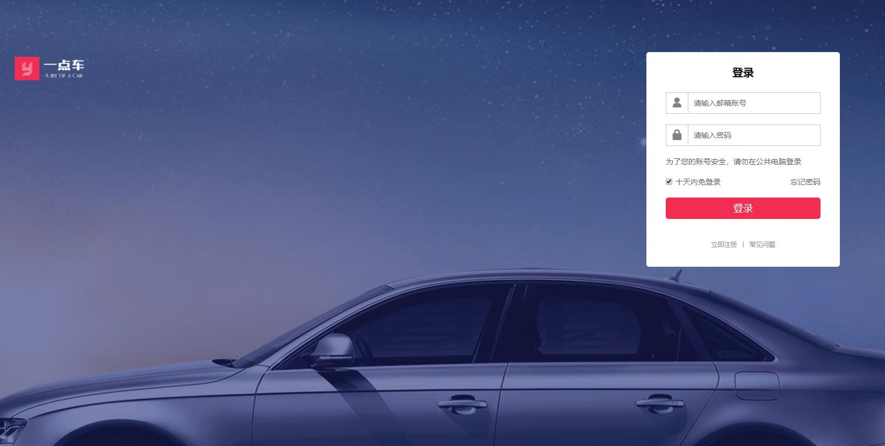
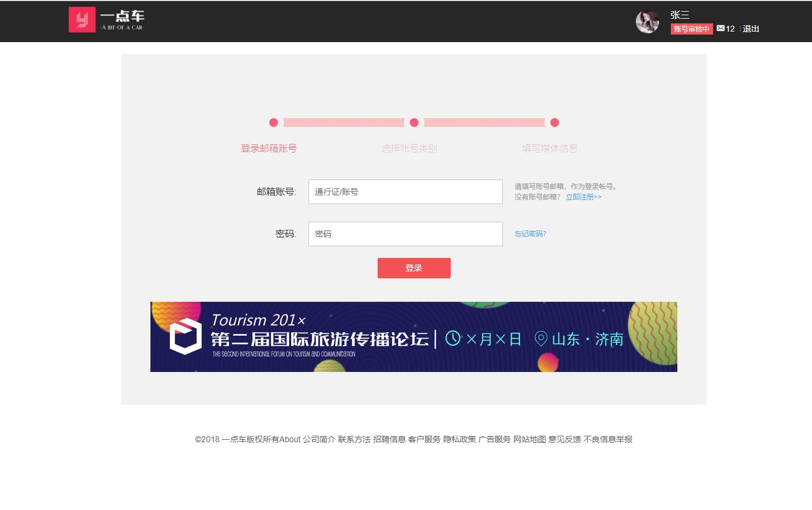

使用vue分组实现了"一点车"管理后台的全部UI

运行

使用webpack的devServer启动:

```javascript
cd vue
yarn install
yarn run dev
```

使用koa启动服务器

```javascript
cd server
yarn install
yarn run dev
```


浏览器打开
后台首页:http://127.0.0.1:8090/#/admin/home
登录页面:http://127.0.0.1:8090/#/login
注册页面:http://127.0.0.1:8090/#/register

部分页面的截图:

首页:
 

发布:
 

登录:
 

注册:
 